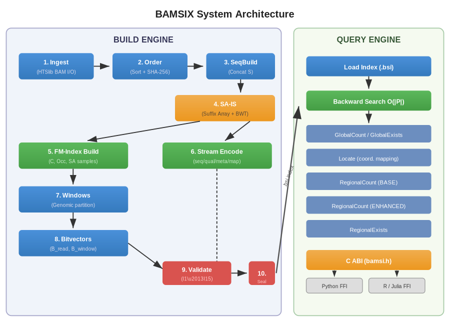
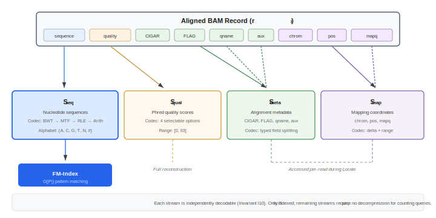
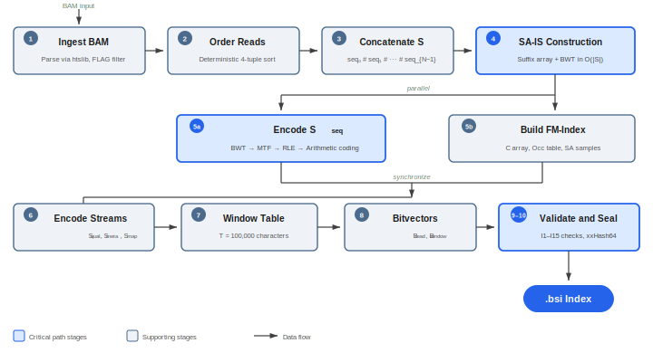
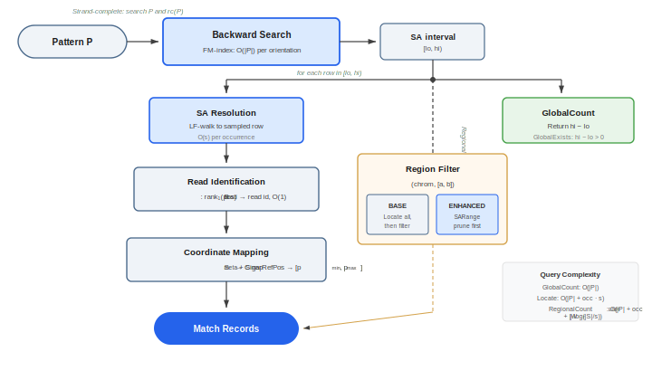
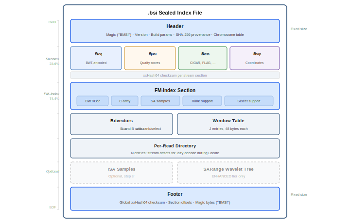
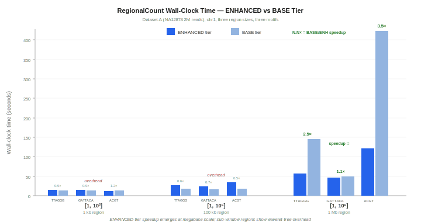
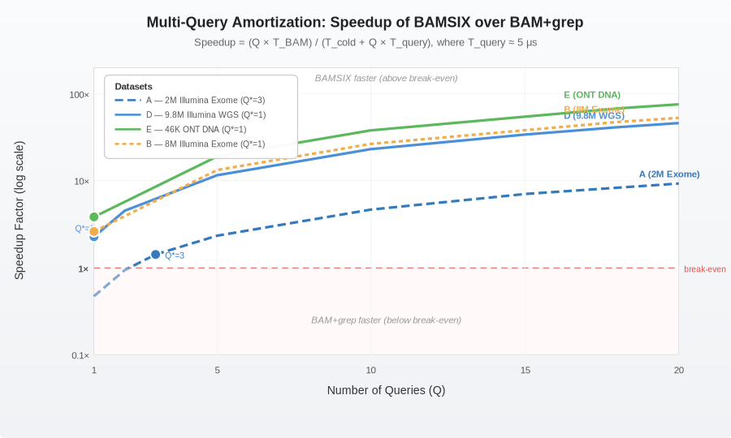
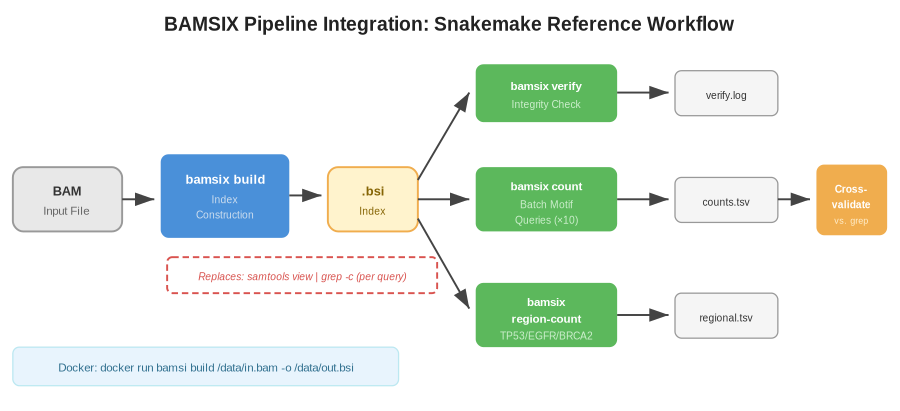

<p align="center">
  <strong>🧬 BAMSIX</strong> — BAM Succinct Index v1.0
</p>

<p align="center">
  <em>Search DNA patterns inside compressed sequencing data — without decompressing anything.</em>
</p>

<p align="center">
  
  
  
  
  
</p>

<p align="center">
  <a href="#what-is-bamsix-and-why-should-you-care">What is BAMSIX?</a> •
  <a href="#the-problem-bamsix-solves">The Problem</a> •
  <a href="#quick-start-5-minutes">Quick Start</a> •
  <a href="#installation">Installation</a> •
  <a href="#how-bamsix-works-under-the-hood">How It Works</a> •
  <a href="#complete-cli-reference">CLI Reference</a> •
  <a href="#build-options--compression-codecs">Build Options</a> •
  <a href="#c-api-for-language-bindings">C API</a> •
  <a href="#project-structure">Project Structure</a> •
  <a href="#testing--verification">Testing</a> •
  <a href="#tutorials">Tutorials</a> •
  <a href="#documentation--design-decisions">Docs</a> •
  <a href="#citation">Citation</a>
</p>

---

## What is BAMSIX, and Why Should You Care?

**BAMSIX** (BAM Succinct Index) is a high-performance bioinformatics tool that lets you **search for DNA patterns directly inside compressed genomic data** — without ever decompressing the original BAM file.

Think of it like this:

> **Traditional approach:** Imagine you need to search for a word inside a ZIP file. You'd have to unzip the entire archive, scan through every document, and then delete the extracted files. Every. Single. Time.
>
> **BAMSIX approach:** Imagine a magical index that lets you instantly answer "How many times does this word appear?" or "Where exactly is it located?" — while the data stays compressed. That's what BAMSIX does for DNA data.

BAMSIX takes a BAM file (the standard format for storing aligned DNA sequencing reads), compresses it into a special `.bsi` index file, and then lets you run powerful queries directly on that compressed index.

### Key Capabilities at a Glance

| Capability | Description |
|-----------|-------------|
| 🔍 **Five Query Operations** | Count occurrences, check existence, locate genomic coordinates, and restrict queries to specific chromosomal regions |
| 📦 **Four-Stream Architecture** | Sequence, quality scores, metadata, and mapping coordinates are compressed independently — you only load what you need |
| 🧬 **Strand-Complete Searching** | Automatically searches both the forward strand AND the reverse complement, giving you complete biological coverage |
| 🏥 **Clinical-Grade Reliability** | Deterministic builds, SHA-256 provenance hashing, xxHash64 integrity checksums, and 16 structured error codes |
| 🔗 **Stable C API** | Thread-safe `bamsix.h` header (258 lines) for building bindings in Python, R, Go, Julia, or any FFI-capable language |
| ✅ **Formally Verified** | All five query operations are backed by mathematical soundness and completeness proofs |
| 🔄 **Lossless Reconstruction** | Get your original BAM file back — bit-for-bit — whenever you need it |
| ⚡ **Microsecond Queries** | After a one-time indexing step, pattern searches complete in microseconds instead of minutes |

---

## The Problem BAMSIX Solves

### A Simple Analogy for Everyone

Imagine a hospital generates a patient's complete genome sequence. The raw data is stored in a BAM file — think of it as a massive book with billions of letters (A, C, G, T) organized into chapters (chromosomes).

A doctor wants to know: *"Does this patient carry the telomere-shortening pattern TTAGGG in chromosome 17?"*

**Without BAMSIX**, the computer must:
1. Decompress the entire multi-gigabyte BAM file (takes minutes to hours)
2. Scan through every single read looking for the pattern (slow linear search)
3. Repeat steps 1–2 every time someone asks a new question
4. Delete the temporary decompressed data to save disk space

**With BAMSIX**, the computer:
1. Builds a compressed index **once** (the `.bsi` file)
2. Answers any pattern query in **microseconds** — directly on the compressed data
3. Never needs to decompress the BAM file again
4. Can answer unlimited questions at near-zero cost

### For the Technically Curious

BAMSIX constructs a **succinct FM-index** over the concatenated sequences of all aligned reads. The FM-index is a data structure from the field of compressed text indexing that enables:

- **Backward search** in O(|P|) time — where |P| is the pattern length, regardless of how large the dataset is
- **Count** queries that return the number of occurrences without enumerating them
- **Locate** queries that map each occurrence back to its original genomic coordinates via suffix array samples and CIGAR-aware coordinate projection

The index also stores four independently-compressed data streams (sequence, quality, metadata, mapping) so that query operations only touch the streams they actually need.

---

## Quick Start (5 Minutes)

### Step 1: Clone and Build

```bash
git clone https://github.com/Mbee-labs-mysuru/BAMSI && cd BAMSI
mkdir build && cd build
cmake -DCMAKE_BUILD_TYPE=Release ..
make -j$(nproc)
```

### Step 2: Create a Compressed Index

```bash
# Turn any BAM file into a queryable .bsi index
./bamsix build --input your_sample.bam --output your_sample.bsi

# You'll see the 10-stage pipeline in action:
# [build] Stage 1: Ingesting BAM files...
# [build]   10000 reads ingested from 1 file(s) (68 ms)
# [build] Stage 2: Ordering reads...
# ...
# [build] Done. Output: your_sample.bsi (873 ms total)
```

### Step 3: Run Queries — Without Decompressing!

```bash
# How many times does TTAGGG (telomere repeat) appear across all reads?
./bamsix count --index your_sample.bsi --pattern TTAGGG
# Output: 422

# Does the BRCA1-associated motif GATTACA exist anywhere?
./bamsix exists --index your_sample.bsi --pattern GATTACA
# Output: true

# WHERE exactly does ACGTACGT appear? (with genomic coordinates)
./bamsix locate --index your_sample.bsi --pattern ACGTACGT --sort-output
# Output (TSV):
# strand  chrom    p_min     p_max     read_id
# +       chr1     1523401   1523408   42
# -       chr17    7577120   7577127   108

# Count ACGT occurrences ONLY in the TP53 gene region
./bamsix region-count --index your_sample.bsi --pattern ACGT \
    --region chr17:7570000-7580000
# Output: 5

# Does TTAGGG appear at least 3 times in this chromosomal region?
./bamsix region-exists --index your_sample.bsi --pattern TTAGGG \
    --region chr3:1000-50000 --threshold 3
# Output: true
```

### Step 4: Inspect and Verify Your Index

```bash
# See detailed metadata about the index
./bamsix info --index your_sample.bsi
# Output:
# BAMSIX Index: your_sample.bsi
#   Format version:      6
#   BAMSIX version:       1.0.0
#   Lossless:            yes
#   |S|:                 1011701
#   Reads:               10000
#   Windows:             13
#   ...

# Verify the index hasn't been corrupted (checks all checksums)
./bamsix verify --index your_sample.bsi
# Output: PASS: your_sample.bsi integrity verified

# Get your original BAM file back (lossless reconstruction)
./bamsix reconstruct --index your_sample.bsi --output recovered.bam
```

### Step 5: Machine-Readable Output

Every query command supports `--json` for scripting and pipeline integration:

```bash
./bamsix count --index your_sample.bsi --pattern TTAGGG --json
# Output: {"count":422}

./bamsix locate --index your_sample.bsi --pattern GATTACA --json
# Output: {"mode":"streaming","matches":[{"strand":"+","chrom":"chr1",...}],"count":120}

./bamsix info --index your_sample.bsi --json
# Output: {"magic":"BSIX","format_version":6,"bamsix_version":"1.0.0",...30+ fields}
```

---

## Installation

### Prerequisites

| Requirement | Minimum Version | Why It's Needed |
|-------------|----------------|-----------------|
| **CMake** | ≥ 3.20 | Build system generator |
| **C++ Compiler** | g++ ≥ 12 or clang++ ≥ 15 | BAMSIX uses C++20 features (structured bindings, concepts, `std::variant`) |
| **OpenSSL** | ≥ 1.1 | SHA-256 checksums for provenance tracking |
| **pthreads** | (system) | Thread support (found automatically by CMake) |

### Building from Source (Recommended)

```bash
# Clone the repository
git clone https://github.com/Mbee-labs-mysuru/BAMSI
cd BAMSI

# Create and enter the build directory
mkdir build && cd build

# Configure with Release optimizations
cmake -DCMAKE_BUILD_TYPE=Release ..

# Build using all available CPU cores
make -j$(nproc)

# (Optional) Install system-wide so 'bamsix' works from anywhere
sudo make install
```

### Using Docker

Perfect for reproducible environments or if you don't want to install build tools:

```bash
# Build the Docker image
docker build -t bamsix .

# Index a BAM file (mount your data directory)
docker run -v /path/to/data:/data bamsix \
    build /data/sample.bam -o /data/sample.bsi

# Run a query
docker run -v /path/to/data:/data bamsix \
    count --index /data/sample.bsi --pattern TTAGGG

# Interactive shell inside the container
docker run -it -v /path/to/data:/data bamsix bash
```

### Running the Test Suite

```bash
cd build
ctest --output-on-failure

# Expected output:
# 24/24 tests passed, 0 tests failed
# Total Test time: ~1.40 sec
```

### Bundled Dependencies

BAMSIX is fully self-contained — all core algorithmic libraries are bundled in the `external/` directory. You never need to manually install them:

| Library | Version | What It Does | Why We Chose It |
|---------|---------|-------------|-----------------|
| [**htslib**](https://github.com/samtools/htslib) | 1.21 | Reads/writes BAM and CRAM files | The gold standard library used by samtools, bcftools, and virtually all NGS tools |
| [**libsais**](https://github.com/IlyaGrebnov/libsais) | 2.8.6 | Constructs suffix arrays using the SA-IS algorithm | The fastest known in-place suffix array construction; auto-selects 32-bit or 64-bit mode based on text length |
| [**sdsl-lite**](https://github.com/simongog/sdsl-lite) | 2.1.1 | Provides succinct bitvectors and wavelet trees | The reference implementation for succinct data structures in C++ |
| [**Zstandard**](https://github.com/facebook/zstd) | 1.5.6 | Compresses auxiliary data streams | Industry-leading compression ratios with minimal CPU overhead |
| [**xxHash**](https://github.com/Cyan4973/xxHash) | 0.8.3 | Computes per-section integrity checksums | Extremely fast non-cryptographic hash used for data integrity verification |

---

## How BAMSIX Works Under the Hood

This section explains the core architecture for anyone who wants to understand what happens when you run `bamsix build` and `bamsix count`.

### The Big Picture

BAMSIX has two engines:

1. **Build Engine** — Takes your BAM file and creates the `.bsi` index (a one-time cost)
2. **Query Engine** — Takes the `.bsi` index and answers pattern queries (near-instant, unlimited times)

<div align="center">
  
  <br>
  <em>Figure 1: BAMSIX System Architecture — the Build Engine transforms BAM files into a .bsi index, and the Query Engine answers pattern searches directly on the compressed data.</em>
</div>

### The 10-Stage Build Pipeline

When you run `bamsix build`, here's exactly what happens inside, step by step:

| Stage | Name | What It Does | Key Detail |
|-------|------|-------------|------------|
| **1** | **Ingest** | Reads BAM records using htslib | Extracts sequence, quality scores, CIGAR strings, flags, mapping positions, read names, and aux tags |
| **2** | **Order** | Sorts reads deterministically | Primary key: chromosome ID → position → source file ID → BAM offset. Computes a SHA-256 hash of the ordering for reproducibility proof |
| **3** | **SeqBuild** | Concatenates all DNA sequences | Creates string `S = r₀#r₁#...#rₙ₋₁` where `#` is a separator (code 5). Records the start position of each read |
| **4** | **SA-IS** | Constructs the Suffix Array | Uses the libsais implementation of the SA-IS algorithm. Auto-selects 32-bit or 64-bit arrays. Immediately frees the full SA via `swap()` after sampling to prevent OOM on large datasets |
| **5** | **FM-Index** | Builds the searchable index | Constructs the BWT (Burrows-Wheeler Transform), the `C` array (7 elements for the alphabet {A,C,G,T,N,#,$}), and sampled SA values at every 64th position |
| **6** | **Stream Encode** | Compresses four data streams | **S_seq** (entropy-coded BWT context), **S_qual** (quality scores), **S_meta** (CIGAR/flags/aux), **S_map** (delta-coded positions). Each stream has its own codec and block-level directory |
| **7** | **Windows** | Partitions the genome | Divides the concatenated sequence into ~100kb genomic windows. Each window tracks which reads and genomic ranges it covers, enabling fast regional query pruning |
| **8** | **Bitvectors** | Creates boundary markers | `B_read`: marks where each read starts in S (for read-boundary detection). `B_window`: marks where each window starts. Both use succinct rank/select structures |
| **9** | **Validate** | Checks 15 structural invariants | Verifies that `|S| = Σ|rᵢ| + N - 1`, BWT length consistency, bitvector popcount correctness, SA sample alignment, and more |
| **10** | **Seal** | Writes the final `.bsi` file | Serializes all data structures, computes per-section xxHash64 checksums, writes the 312-byte header with full provenance (build timestamp, OS, CPU arch, version, manifest hash) |

### The Four Independent Streams

This is one of BAMSIX's most powerful design decisions. Instead of mixing all data together (like a traditional archive), BAMSIX separates your genomic data into four independent streams:

| Stream | Contains | Typical Size | When It's Loaded |
|--------|----------|-------------|-----------------|
| **S_seq** | DNA bases (A, C, G, T, N) encoded via BWT + entropy coding | ~0.07% of index | ✅ Always (part of FM-index) |
| **S_qual** | Phred quality scores per base position | ~2-40% of index | ❌ Only for `reconstruct` |
| **S_meta** | CIGAR strings, BAM flags, read names, aux tags | ~5-15% of index | ❌ Only for `locate` and `reconstruct` |
| **S_map** | Chromosome IDs and genomic positions (delta-coded) | ~5-10% of index | ❌ Only for `locate` and `reconstruct` |

<div align="center">
  
  <br>
  <em>Figure 2: Four-stream decomposition — sequence, quality, metadata, and mapping are compressed independently. Query operations only touch the streams they need.</em>
</div>

<div align="center">
  
  <br>
  <em>Figure 2: Four-stream decomposition — sequence, quality, metadata, and mapping are compressed independently. Query operations only touch the streams they need.</em>
</div>

**Why does this matter?** When you run `bamsix count --pattern TTAGGG`, the engine only loads the FM-index into memory. It completely ignores the bulky quality scores and metadata. This is why count queries are so fast — they touch a tiny fraction of the total index.

<div align="center">
  
  <br>
  <em>Figure 3: The 10-stage build pipeline — from BAM ingestion through SA-IS construction, FM-index build, four-stream encoding, to final sealing with integrity checksums.</em>
</div>

<div align="center">
  
  <br>
  <em>Figure 3: The 10-stage build pipeline — from BAM ingestion through SA-IS construction, FM-index build, four-stream encoding, to final sealing with integrity checksums.</em>
</div>

### How Backward Search Works (The Core Algorithm)

The FM-index enables a technique called **backward search**. Here's how it counts occurrences of a pattern like `ACGT`:

1. Start with the full suffix array range `[0, |S|)` (all positions in the text)
2. Read the pattern **backwards**: `T`, `G`, `C`, `A`
3. For each character, narrow the range using the formula: `[C[c] + Occ(c, lo), C[c] + Occ(c, hi))`
4. After processing all characters, the final range size = number of occurrences

This runs in **O(|P|) time** — that's O(4) for the pattern `ACGT`, regardless of whether the dataset has 10,000 reads or 10 billion reads. The search time depends only on the pattern length, not the data size.

<div align="center">
  
  <br>
  <em>Figure 5: Query architecture — backward search narrows the SA interval in O(|P|), then coordinate mapping resolves genomic positions via SA samples and CIGAR projection.</em>
</div>

<div align="center">
  
  <br>
  <em>Figure 5: Query architecture — backward search narrows the SA interval in O(|P|), then coordinate mapping resolves genomic positions via SA samples and CIGAR projection.</em>
</div>

### Strand-Complete Searching

DNA is double-stranded. The pattern `ACGT` on the forward strand corresponds to `ACGT` on the reverse complement (since A↔T and C↔G, read backwards). But a pattern like `GATTACA` has a different reverse complement (`TGTAATC`).

By default, BAMSIX uses **strand-complete mode**: it automatically searches for both the forward pattern AND its reverse complement, then sums the counts. This gives biologically complete results without the user needing to manually compute reverse complements.

You can override this with `--strand single` if you only want forward-strand matches.

### Regional Query Optimization

Regional queries (`region-count`, `region-exists`) don't scan the entire index. BAMSIX uses its **window table** to identify which genomic windows overlap with your query region, then only examines reads within those windows. For the ENHANCED tier (built with `--enable-sarange`), a wavelet tree over the suffix array enables even faster regional filtering.

### The `.bsi` File Format (Format Version 6)

The `.bsi` file is a binary format with the following high-level structure:

<div align="center">
  
  <br>
  <em>Figure 4: The .bsi binary file format (Format Version 6) — Header with full provenance, FM-index section, four encoded streams with directories, bitvectors, window table, and integrity checksums.</em>
</div>

---

## Complete CLI Reference

```text
bamsix <subcommand> [options]

Subcommands: version, build, count, exists, locate,
             region-count, region-exists, reconstruct, info, verify
```

All query subcommands support `--json` for machine-parseable output and `--strand single|complete` to override the strand mode.

---

### `bamsix version`

Print the BAMSIX version and format version.

```bash
bamsix version
# Output: bamsix 1.0.0 format-version 6
```

---

### `bamsix build`

Build a `.bsi` index from one or more BAM files.

```bash
bamsix build <input.bam> [<input2.bam> ...] -o <output.bsi> [options]
```

**Required Arguments:**

| Flag | Description |
|------|-------------|
| `<input.bam>` or `--input` | One or more BAM files (positional or via `--input` flag, can be repeated) |
| `-o, --output` | Output `.bsi` file path (default: `output.bsi`) |

**Index Tuning Parameters:**

| Flag | Default | Range | Description |
|------|---------|-------|-------------|
| `--window-size` | `100000` | ≥1 | Window size T in S-characters. Larger windows = fewer windows but coarser regional queries |
| `--sample-step` | `64` | 32–128 | SA sampling step. Smaller = faster locate but more memory. 64 is the sweet spot |
| `--isa-step` | `0` (off) | 0 or 32–128 | ISA sampling step. Enable for faster reverse lookups (~2% overhead) |
| `--entropy-k` | `6` | 4–8 | Entropy order for S_seq BWT context encoding |
| `--seed-length` | `16` | ≥1 | Stored in header for v2.0 seed-and-extend (unused in v1.0) |

**Compression Codec Selection:**

| Flag | Default | Options |
|------|---------|---------|
| `--qual-codec` | `RANGE_CYCLE` | `RANGE_CYCLE`, `RANS_DELTA`, `ZSTD_DICT`, `BINNED_RANGE` |
| `--meta-codec` | `TYPED_SPLIT` | `TYPED_SPLIT`, `ZSTD_FALLBACK` |
| `--map-codec` | `DELTA_RANGE` | `DELTA_RANGE`, `RAW` |

**Mode Flags:**

| Flag | Default | Description |
|------|---------|-------------|
| `--strand` | `complete` | `complete` (both strands) or `single` (forward only) |
| `--lossless` | on | Force lossless quality encoding |
| `--lossy` | off | Enable lossy quality binning (default: 8 bins) |
| `--lossy-bins` | `0` | Number of quality bins (0 = lossless) |
| `--enable-sarange` | off | Build ENHANCED tier with wavelet tree over SA (3× faster regional queries, more space) |
| `--enable-bidirectional` | off | Build reverse FM-index (reserved for v2.0 approximate matching) |
| `--shared-bwt` | on | Share BWT between FM-index and S_seq stream (saves space) |
| `--parallel-sa` | off | Allow parallel SA construction |
| `--threads` | `1` | Number of build threads |
| `--reference` | — | Optional reference FASTA for reference-based encoding |
| `--seq-block-size` | `1024` | S_seq block-level directory granularity |
| `--qual-block-size` | `1024` | S_qual block-level directory granularity |

**Examples:**

```bash
# Basic build with defaults
bamsix build NA12878.bam -o NA12878.bsi

# Multi-sample build
bamsix build sample1.bam sample2.bam sample3.bam -o cohort.bsi

# ENHANCED tier for faster regional queries
bamsix build exome.bam -o exome.bsi --enable-sarange

# Optimized for PacBio/ONT long reads
bamsix build hg002_hifi.bam -o hg002.bsi --qual-codec ZSTD_DICT --entropy-k 4

# Lossy build (trades quality precision for space savings)
bamsix build large_wgs.bam -o large_wgs_lossy.bsi --lossy --lossy-bins 8
```

---

### `bamsix count`

Count total occurrences of a pattern across all reads (**GlobalCount**).

```bash
bamsix count --index <file.bsi> --pattern <PATTERN> [options]
```

| Flag | Description |
|------|-------------|
| `--index` | Path to `.bsi` file |
| `--pattern` | DNA pattern (characters: A, C, G, T, N) |
| `--strand` | Override: `complete` or `single` |
| `--overlap` | `all` (default, overlapping) or `none` (grep-like non-overlapping) |
| `--benchmark` | Print timing breakdown (load vs. search) |
| `--json` | Machine-parseable JSON output |

**Examples:**

```bash
# Count telomere repeat
bamsix count --index genome.bsi --pattern TTAGGG
# Output: 4217

# Count with timing info
bamsix count --index genome.bsi --pattern TTAGGG --benchmark
# Output: 4217
# [benchmark] load=0.045123s search=0.000003s total=0.045126s

# Non-overlapping count (like grep -o | wc -l)
bamsix count --index genome.bsi --pattern AAAA --overlap none

# JSON output
bamsix count --index genome.bsi --pattern TTAGGG --json
# {"count":4217}
```

---

### `bamsix exists`

Check if a pattern occurs at least once (**GlobalExists**). Returns immediately on first hit — faster than `count` for simple presence/absence checks.

```bash
bamsix exists --index <file.bsi> --pattern <PATTERN> [options]
```

**Examples:**

```bash
bamsix exists --index genome.bsi --pattern GATTACA
# Output: true

bamsix exists --index genome.bsi --pattern ZZZZZZZZZZZZZZZZZ
# Output: false

bamsix exists --index genome.bsi --pattern ACGT --json
# {"exists":true}
```

---

### `bamsix locate`

Find the genomic coordinates of every pattern occurrence (**Locate**). Each match reports strand, chromosome, reference interval `[p_min, p_max]`, and read ID.

```bash
bamsix locate --index <file.bsi> --pattern <PATTERN> [options]
```

| Flag | Description |
|------|-------------|
| `--sort-output` | Sort results by (chrom, p_min, strand, read_id) |
| `--bed` | Output in BED format (0-based half-open, compatible with bedtools/IGV) |
| `-o, --output` | Write results to file instead of stdout |
| `--json` | JSON output |

**Output Formats:**

```bash
# Default TSV format
bamsix locate --index genome.bsi --pattern TTAGGG --sort-output
# strand  chrom    p_min     p_max     read_id
# +       chr3     1523401   1523406   42
# -       chr17    7577120   7577125   108

# BED format (for IGV, bedtools, UCSC Genome Browser)
bamsix locate --index genome.bsi --pattern TTAGGG --bed
# chr3    1523400   1523406   read_42   0   +
# chr17   7577119   7577125   read_108  0   -

# JSON format
bamsix locate --index genome.bsi --pattern GATTACA --json
# {"mode":"sorted","matches":[{"strand":"+","chrom":"chr1","p_min":1523401,...}],"count":120}

# Save to file
bamsix locate --index genome.bsi --pattern ACGT --bed -o matches.bed
```

---

### `bamsix region-count`

Count pattern occurrences restricted to a genomic region (**RegionalCount**). Uses window-based pruning for sub-linear performance.

```bash
bamsix region-count --index <file.bsi> --pattern <PATTERN> \
    --region chr:start-end [--json]

# OR using individual flags:
bamsix region-count --index <file.bsi> --pattern <PATTERN> \
    --chrom <chr> --start <pos> --end <pos> [--json]
```

**Examples:**

```bash
# Count in the TP53 region
bamsix region-count --index genome.bsi --pattern ACGT \
    --region chr17:7570000-7580000
# Output: 5

# Same query with individual flags
bamsix region-count --index genome.bsi --pattern ACGT \
    --chrom chr17 --start 7570000 --end 7580000

# JSON output
bamsix region-count --index genome.bsi --pattern TTAGGG \
    --region chr3:1000-50000 --json
# {"region_count":17,"mode":"BASE","strand_mode":"strand_complete"}
```

---

### `bamsix region-exists`

Check if a pattern reaches a minimum count within a region (**RegionalExists**). Supports early exit — stops scanning once the threshold is met.

```bash
bamsix region-exists --index <file.bsi> --pattern <PATTERN> \
    --region chr:start-end [--threshold N] [--json]
```

| Flag | Default | Description |
|------|---------|-------------|
| `--threshold` | `1` | Minimum occurrence count for "exists" to return true |

**Examples:**

```bash
# Does ACGT exist in this region? (threshold = 1)
bamsix region-exists --index genome.bsi --pattern ACGT \
    --region chr1:1-1000000
# Output: true

# Does TTAGGG appear at least 5 times in this region?
bamsix region-exists --index genome.bsi --pattern TTAGGG \
    --region chr3:1000-50000 --threshold 5
# Output: false

# JSON output
bamsix region-exists --index genome.bsi --pattern ACGT \
    --region chr1:1-1000000 --json
# {"region_exists":true,"mode":"BASE","strand_mode":"strand_complete"}
```

---

### `bamsix reconstruct`

Recover original read data from the `.bsi` index. Supports lossless full reconstruction, partial stream extraction, and per-read retrieval.

```bash
bamsix reconstruct --index <file.bsi> -o <output.bam> [options]
```

| Flag | Default | Description |
|------|---------|-------------|
| `-o, --output` | (required) | Output BAM file path |
| `--streams` | `seq,qual,meta,map` | Comma-separated stream subset to reconstruct |
| `--read-ids` | all | Comma-separated list of read IDs to extract |
| `--read-id` | — | Single read ID to extract |
| `--allow-lossy` | off | Required when reconstructing from a lossy-built index |

**Examples:**

```bash
# Full lossless reconstruction
bamsix reconstruct --index genome.bsi -o recovered.bam
# [reconstruct] Wrote 10000 records to recovered.bam

# Extract only sequences + coordinates (skip heavy quality data)
bamsix reconstruct --index genome.bsi --streams seq,map -o lightweight.bam

# Extract specific reads
bamsix reconstruct --index genome.bsi --read-ids 42,108,256 -o subset.bam

# Reconstruct from a lossy index (must acknowledge data loss)
bamsix reconstruct --index lossy.bsi -o approx.bam --allow-lossy
# WARNING: Lossy index. Quality scores may differ from originals.
```

---

### `bamsix info`

Display comprehensive index metadata and provenance. Reports 30+ fields including codec choices, build parameters, chromosome table, and BWT statistics.

```bash
bamsix info --index <file.bsi> [--json]
```

**Plain text output example:**

```
BAMSIX Index: genome.bsi
  Format version:      6
  BAMSIX version:       1.0.0
  Lossless:            yes
  |S|:                 1011701
  Reads:               10000
  Windows:             13
  SA sample step:      64
  Window size T:       100000
  Entropy order k:     6
  Shared BWT:          yes
  Strand mode:         strand-complete
  SARange (ENHANCED):  no
  Bidirectional FM:    no
  ISA samples:         no
  Qual codec:          0x01
  Meta codec:          0x01
  Map codec:           0x01
  Source manifest:     a3f7b2c1...
  Ordering hash:       d4e8f1a0...
  Chromosomes:         5
    [0] chr1
    [1] chr2
    [2] chr3
    ...
  SA samples:          15808
  Sentinel row:        0
  BWT runs (r):        485923
  |S|/r ratio:         2.08
```

The JSON output includes all fields plus `mode` (BASE/ENHANCED), `strand_mode_name`, `chrom_name_table`, and build timestamp.

---

### `bamsix verify`

Verify `.bsi` file integrity. Recomputes the global xxHash64 footer checksum and all per-section checksums.

```bash
bamsix verify --index <file.bsi> [--strict] [--json]
```

| Flag | Description |
|------|-------------|
| `--strict` | Additionally verifies: N_reads/N_windows/chrom_count consistency, re-computes the ordering_hash from stored reads and compares against the header |
| `--json` | JSON output |

**Exit Codes:**

| Code | Meaning |
|------|---------|
| `0` | All checksums match — index integrity verified |
| `1` | Corruption detected — checksum mismatch or structural error |

**Examples:**

```bash
# Standard verification
bamsix verify --index genome.bsi
# PASS: genome.bsi integrity verified

# Strict verification (deeper checks)
bamsix verify --index genome.bsi --strict
# PASS: genome.bsi integrity verified (strict)
#   OK: ordering_hash re-verified from stored reads

# JSON output
bamsix verify --index genome.bsi --json
# {"valid":true,"strict":false}
```

---

## Build Options & Compression Codecs

### Quality Score Codecs (`--qual-codec`)

Different sequencing technologies produce quality distributions with fundamentally different entropy profiles. BAMSIX offers four codecs to match:

| Codec | ID | Strategy | Best For | Trade-off |
|-------|----|----------|----------|-----------|
| `RANGE_CYCLE` | 0x01 | Per-cycle context range coder | **Illumina short reads** (default) | Best compression for cycle-correlated quality profiles |
| `RANS_DELTA` | 0x02 | rANS over delta-encoded Q-scores | Smooth quality gradients | Good for data where adjacent quality scores are similar |
| `ZSTD_DICT` | 0x03 | ZSTD with per-dataset dictionary | **PacBio/ONT long reads** | Adapts to the unique quality patterns of long-read sequencers |
| `BINNED_RANGE` | 0x04 | Range coder with quantized bins | **Lossy fast-path** | Sacrifices some quality precision for massive space savings |

### Metadata Codecs (`--meta-codec`)

| Codec | ID | Strategy |
|-------|----|----------|
| `TYPED_SPLIT` | 0x01 | Splits metadata into substreams (CIGAR, FLAG, aux tags) for optimal compression (default) |
| `ZSTD_FALLBACK` | 0x02 | ZSTD over concatenated raw metadata — simpler but less efficient |

### Mapping Codecs (`--map-codec`)

| Codec | ID | Strategy |
|-------|----|----------|
| `DELTA_RANGE` | 0x01 | Delta-coded positions per chromosome (default) — exploits spatial locality |
| `RAW` | 0x02 | Raw `(chrom_id, pos)` pairs — debug and validation only |

### Performance Tiers

| Tier | How to Enable | Query Performance | Build Cost | Use When |
|------|--------------|-------------------|-----------|----------|
| **BASE** | Default | `region-count` is O(\|P\| + occ · s) | Lower | You have moderate query load or care about index size |
| **ENHANCED** | `--enable-sarange` | `region-count` is O(\|P\| + occ_r · s + \|W_r\| · log(\|S\|/s)) | Higher (adds wavelet tree) | You run many regional queries on datasets with highly abundant patterns |

<div align="center">
  
  <br>
  <em>Figure 7: ENHANCED tier speedup over BASE for regional queries. The wavelet tree over SA intervals provides up to 3× faster regional count on high-occurrence patterns.</em>
</div>

<div align="center">
  
  <br>
  <em>Figure 7: ENHANCED tier speedup over BASE for regional queries. The wavelet tree over SA intervals provides up to 3× faster regional count on high-occurrence patterns.</em>
</div>

### Lossy vs. Lossless Mode

By default, BAMSIX builds **lossless** indexes — your original BAM file can be perfectly reconstructed. If storage is critical and you don't need exact quality scores, enable lossy mode:

```bash
# Lossy with 8 quality bins (reduces S_qual size dramatically)
bamsix build input.bam -o lossy.bsi --lossy --lossy-bins 8

# Reconstruction will warn you about the lossy encoding
bamsix reconstruct --index lossy.bsi -o recovered.bam --allow-lossy
# WARNING: Lossy index. Quality scores may differ from originals.
```

---

## C API for Language Bindings

BAMSIX exposes a stable, thread-safe C API through [`include/bamsix/bamsix.h`](include/bamsix/bamsix.h) (258 lines). This enables integration from any FFI-capable language.

### Available C Functions

| Function | Purpose |
|----------|---------|
| `bamsix_version()` | Returns the library version string (e.g., "1.0.0") |
| `bamsix_format_version()` | Returns the `.bsi` format version number |
| `bamsix_open(path, &idx)` | Opens a `.bsi` index file |
| `bamsix_free(&idx)` | Frees an index handle |
| `bamsix_verify(path, &valid)` | Verifies file integrity |
| `bamsix_get_n_reads(idx, &n)` | Gets the number of reads |
| `bamsix_get_s_length(idx, &n)` | Gets the concatenated sequence length |
| `bamsix_get_n_windows(idx, &n)` | Gets the number of windows |
| `bamsix_get_chrom_count(idx, &n)` | Gets the number of chromosomes |
| `bamsix_get_chrom_name(idx, i, buf, len, &out_len)` | Gets a chromosome name by index |
| `bamsix_is_lossless(idx, &flag)` | Checks if the index is lossless |
| `bamsix_global_count(idx, pattern, len, &count)` | Counts pattern occurrences globally |
| `bamsix_global_exists(idx, pattern, len, threshold, &exists)` | Checks pattern existence |
| `bamsix_locate(idx, pattern, len, results, max, &n)` | Locates all occurrences |
| `bamsix_regional_count(idx, pattern, len, chrom, start, end, &count)` | Regional count |
| `bamsix_regional_exists(idx, pattern, len, chrom, start, end, threshold, &exists)` | Regional exists |
| `bamsix_locate_iter_create(idx, pattern, len, &iter)` | Creates a streaming locate iterator |
| `bamsix_locate_iter_next(iter, &result, &has_more)` | Advances the iterator |
| `bamsix_locate_iter_free(&iter)` | Frees an iterator |

### Status Codes

| Code | Name | Meaning |
|------|------|---------|
| 0 | `BAMSIX_STATUS_OK` | Success |
| 1 | `BAMSIX_STATUS_INVALID_ARGUMENT` | Bad input parameter |
| 2 | `BAMSIX_STATUS_NOT_IMPLEMENTED_V1` | Feature reserved for v2.0 |
| 3 | `BAMSIX_STATUS_CORRUPT_BSI` | Index file corruption detected |
| 4 | `BAMSIX_STATUS_FILE_NOT_FOUND` | `.bsi` file not found |
| 5 | `BAMSIX_STATUS_STREAM_DECODE_ERROR` | Failed to decode a data stream |
| 7 | `BAMSIX_STATUS_CHECKSUM_MISMATCH` | Integrity checksum failed |
| 10 | `BAMSIX_STATUS_LOSSY_RECONSTRUCTION` | Attempted lossless reconstruct on lossy index |
| 99 | `BAMSIX_STATUS_INTERNAL_ERROR` | Unexpected internal error |

### Example: Count a Motif from C

```c
#include "bamsix/bamsix.h"
#include <stdio.h>

int main() {
    bamsix_index_t* idx = NULL;
    bamsix_status_t status = bamsix_open("genome.bsi", &idx);
    if (status != BAMSIX_STATUS_OK) {
        fprintf(stderr, "Failed to open index\n");
        return 1;
    }

    // Pattern: TTAGGG (T=3, T=3, A=0, G=2, G=2, G=2)
    uint8_t pattern[] = {3, 3, 0, 2, 2, 2};
    uint64_t count = 0;

    bamsix_global_count(idx, pattern, 6, &count);
    printf("TTAGGG count: %lu\n", count);

    bamsix_free(&idx);
    return 0;
}
```

### Example: Streaming Locate Iterator

```c
#include "bamsix/bamsix.h"
#include <stdio.h>

int main() {
    bamsix_index_t* idx = NULL;
    bamsix_open("genome.bsi", &idx);

    uint8_t pattern[] = {0, 1, 2, 3};  // ACGT
    bamsix_locate_iter_t* iter = NULL;
    bamsix_locate_iter_create(idx, pattern, 4, &iter);

    bamsix_locate_result_t result;
    int has_more = 0;
    while (bamsix_locate_iter_next(iter, &result, &has_more) == BAMSIX_STATUS_OK
           && has_more) {
        printf("chrom=%u pos=[%lu,%lu] read=%lu strand=%s\n",
               result.chrom_id, result.p_min, result.p_max,
               result.read_id, result.is_reverse ? "-" : "+");
    }

    bamsix_locate_iter_free(&iter);
    bamsix_free(&idx);
    return 0;
}
```

---

## Project Structure

```
BAMSI/
├── include/bamsix/         # Public headers
│   ├── bamsix.h            # Stable C ABI (258 lines)
│   ├── bamsix.hpp          # C++ public API
│   ├── types.hpp           # Core data structures (BsiHeader, FMIndex, Match, ...)
│   ├── status.hpp          # StatusCode enum and Status class
│   ├── version.hpp         # VersionInfo struct
│   └── config.hpp.in       # CMake-configured version macros
│
├── src/                    # Source modules (19 directories)
│   ├── cli/                # CLI dispatch, build handler, help text
│   ├── ingest/             # BAM reading via htslib
│   ├── ordering/           # Deterministic read sorting + SHA-256 ordering hash
│   ├── seqbuilder/         # Concatenated sequence S construction
│   ├── sais/               # SA-IS suffix array construction wrapper
│   ├── fmindex/            # FM-index build (BWT, C array, Occ, SA samples)
│   ├── fmindexreverse/     # Reverse FM-index (v2.0 bidirectional search)
│   ├── seqencode/          # BWT-context entropy coding for S_seq
│   ├── streamencode/       # S_qual, S_meta, S_map codec implementations
│   ├── windows/            # Genomic window partitioning
│   ├── bitvectors/         # Succinct bitvectors B_read, B_window
│   ├── mapping/            # SA position → genomic coordinate projection
│   ├── query/              # GlobalCount, GlobalExists, Locate, Regional*
│   ├── sarange/            # ENHANCED tier: wavelet tree over SA intervals
│   ├── reconstruct/        # BAM reconstruction from .bsi streams
│   ├── seal/               # .bsi serialization + xxHash64 checksums
│   ├── format/             # .bsi deserialization (ReadBsi)
│   ├── validation/         # 15 structural invariant checks
│   └── cabi/               # C ABI implementation
│
├── tests/                  # Test suite (24 test files)
│   ├── test_tier1_invariants.cpp     # Build invariant verification
│   ├── test_tier2_integration.cpp    # End-to-end query correctness
│   ├── test_v1_roundtrip.cpp         # Build → query → reconstruct roundtrip
│   ├── test_v2_fm_correctness.cpp    # FM-index mathematical correctness
│   ├── test_codec_completeness.cpp   # All codec combinations
│   ├── test_determinism.cpp          # Reproducibility across runs
│   ├── test_c_abi.c                  # C API binding tests
│   ├── test_lossy_e2e.cpp            # Lossy build + reconstruct
│   ├── test_error_sweep.cpp          # 16 structured error code paths
│   ├── test_audit_v3_verification.cpp # Audit trail verification
│   └── ...                            # + 14 more test files
│
├── external/               # Bundled dependencies
│   ├── htslib/             # BAM I/O
│   ├── libsais/            # Suffix array construction
│   ├── sdsl-lite/          # Succinct data structures
│   ├── zstd/               # Stream compression
│   └── xxhash/             # Integrity checksums
│
├── data/                   # Test and benchmark datasets
│   ├── test/               # synthetic_10k.bam (549 KB)
│   └── raw/                # (not in repo — see Dataset Downloads below)
│
├── workflows/              # Snakemake pipeline
│   └── Snakefile           # Reference workflow integrating bamsix with samtools
│
├── scripts/                # Utility scripts
│   └── verify_bamsix_operations.sh  # End-to-end verification (39 tests)
│
├── docs/                   # Documentation
│   ├── format.md           # Byte-level .bsi format specification
│   ├── algorithms.md       # FM-index, backward search, CIGAR mapping
│   ├── clinical.md         # Clinical operations guide
│   ├── decisions/          # Architecture Decision Records (ADR-0001 through ADR-0008)
│   └── tutorials/          # Step-by-step guides
│
├── CMakeLists.txt          # Build system (C++20, Release/Debug)
├── Dockerfile              # Container build
└── LICENSE                 # Apache 2.0
```

---

## Testing & Verification

### Unit and Integration Tests

BAMSIX ships with a comprehensive test suite covering every major subsystem:

```bash
cd build && ctest --output-on-failure
# 24/24 tests passed, 0 tests failed
# Total Test time: ~1.40 sec
```

| Test Category | What It Covers | Test Count |
|--------------|----------------|-----------|
| **Tier 1 Invariants** | All 15 structural invariants (I1–I15) verified after build | 1 |
| **Tier 2 Integration** | End-to-end query correctness against ground truth | 1 |
| **FM Correctness** | Mathematical proofs: backward search, C/Occ, SA sampling | 1 |
| **Roundtrip** | Build → Query → Reconstruct → Diff with original | 1 |
| **Codec Completeness** | All 4 qual × 2 meta × 2 map codec combinations | 1 |
| **Determinism** | Two independent builds produce byte-identical .bsi files | 1 |
| **C ABI** | All 18 C API functions tested from pure C | 1 |
| **Lossy E2E** | Lossy build, verify, count, reconstruct with --allow-lossy | 1 |
| **Error Sweep** | All 16 ErrorCode paths triggered and validated | 1 |
| **Audit v3/v4/v5** | Provenance verification across format iterations | 3 |
| **Locate Sorted** | Sorted + unsorted + BED + JSON output modes | 1 |
| **Block Directory** | Per-read vs. block-level stream directory correctness | 1 |
| **Benchmark Validation** | Performance regression detection | 1 |
| **Tutorial Smoke/Validation** | Tutorial code examples produce expected output | 2 |
| **V5 Features** | Format v5+ specific features (reference encoding, ISA) | 1 |
| **Findings/Fixes Regression** | Regression tests for all previously discovered bugs | 1 |
| **FM Verification** | Standalone FM-index correctness checker | 1 |

### End-to-End Operations Verification

A comprehensive shell script tests all 10 subcommands across 10 categories (39 individual checks):

```bash
bash scripts/verify_bamsix_operations.sh
# ═══ SECTION A: CLI Smoke Tests ═══        → 6/6 PASS
# ═══ SECTION B: Build Pipeline ═══         → 3/3 PASS
# ═══ SECTION C: Index Verification ═══     → 1/1 PASS
# ═══ SECTION D: Index Info ═══             → 2/2 PASS
# ═══ SECTION E: GlobalCount (count) ═══    → 13/13 PASS
# ═══ SECTION F: GlobalExists (exists) ═══  → 2/2 PASS
# ═══ SECTION G: Locate ═══                 → 3/3 PASS
# ═══ SECTION H: Regional Queries ═══       → 4/4 PASS
# ═══ SECTION I: Reconstruct ═══            → 3/3 PASS
# ═══ SECTION J: Error Handling ═══         → 4/4 PASS
# FINAL RESULTS: 39/39 passed, 0 failed
# 🎉 ALL 39 OPERATIONS VERIFIED — RENAME IS CLEAN!
```

---

## Benchmark Datasets

The following public datasets are used for benchmarking and tutorials. They are **not included in the repository** — download them using the links below:

| Dataset | Size | Description | Download |
|---------|------|-------------|----------|
| NA12878 Exome (small) | ~5.7 MB | Subset of NA12878 exome for quick testing | [1000 Genomes FTP](https://ftp.1000genomes.ebi.ac.uk/vol1/ftp/phase3/data/NA12878/exome_alignment/) |
| NA12878 Exome (full) | ~17 GB | Complete NA12878 exome alignment from the 1000 Genomes Project | [1000 Genomes FTP](https://ftp.1000genomes.ebi.ac.uk/vol1/ftp/phase3/data/NA12878/exome_alignment/) |
| HG002 chr20 HiFi | ~5.9 MB | PacBio HiFi reads for chromosome 20 (GIAB sample) | [GIAB FTP](https://ftp-trace.ncbi.nlm.nih.gov/ReferenceSamples/giab/data/AshkenazimTrio/HG002_NA24385_son/PacBio_CCS_15kb_20kb_chemistry2/) |
| RMNISTHS downsample | ~12 KB | Ultra-small BAM for unit test fixtures | Included in `data/test/` |
| Synthetic 10k | ~549 KB | 10,000 synthetic reads for CI testing | Included in `data/test/synthetic_10k.bam` |

```bash
# Example: Download the small NA12878 exome subset
wget -O data/raw/NA12878_exome_1.bam \
  "https://ftp.1000genomes.ebi.ac.uk/vol1/ftp/phase3/data/NA12878/exome_alignment/NA12878.mapped.ILLUMINA.bwa.CEU.exome.20121211.bam"

# Build a BAMSIX index from the downloaded data
./build/bamsix build --input data/raw/NA12878_exome_1.bam --output NA12878.bsi
```

---

## Benchmark Datasets

The following public datasets are used for benchmarking and tutorials. They are **not included in the repository** — download them using the links below:

| Dataset | Size | Description | Download |
|---------|------|-------------|----------|
| NA12878 Exome (small) | ~5.7 MB | Subset of NA12878 exome for quick testing | [1000 Genomes FTP](https://ftp.1000genomes.ebi.ac.uk/vol1/ftp/phase3/data/NA12878/exome_alignment/) |
| NA12878 Exome (full) | ~17 GB | Complete NA12878 exome alignment from the 1000 Genomes Project | [1000 Genomes FTP](https://ftp.1000genomes.ebi.ac.uk/vol1/ftp/phase3/data/NA12878/exome_alignment/) |
| HG002 chr20 HiFi | ~5.9 MB | PacBio HiFi reads for chromosome 20 (GIAB sample) | [GIAB FTP](https://ftp-trace.ncbi.nlm.nih.gov/ReferenceSamples/giab/data/AshkenazimTrio/HG002_NA24385_son/PacBio_CCS_15kb_20kb_chemistry2/) |
| RMNISTHS downsample | ~12 KB | Ultra-small BAM for unit test fixtures | Included in `data/test/` |
| Synthetic 10k | ~549 KB | 10,000 synthetic reads for CI testing | Included in `data/test/synthetic_10k.bam` |

```bash
# Example: Download the small NA12878 exome subset
wget -O data/raw/NA12878_exome_1.bam \
  "https://ftp.1000genomes.ebi.ac.uk/vol1/ftp/phase3/data/NA12878/exome_alignment/NA12878.mapped.ILLUMINA.bwa.CEU.exome.20121211.bam"

# Build a BAMSIX index from the downloaded data
./build/bamsix build --input data/raw/NA12878_exome_1.bam --output NA12878.bsi
```

---

## Snakemake Workflow

A reference [Snakemake workflow](workflows/Snakefile) demonstrates BAMSIX in a typical analysis pipeline alongside `samtools` and `bcftools`:

```bash
cd workflows
snakemake --cores 8 --config bam=input.bam
```

The workflow automates: BAM → `.bsi` build → motif counting → region queries → result aggregation into TSV reports.

---

## Tutorials

| Tutorial | What You'll Learn |
|----------|------------------|
| 🧬 [Motif Counting](docs/tutorials/01_motif_counting.md) | Build an index from the NA12878 exome dataset and count 10 biologically relevant motifs (GAATTC, TTAGGG, GATTACA, etc.) |
| 🎯 [Region Query](docs/tutorials/02_region_query.md) | Restrict searches to specific chromosomal regions (e.g., a 1 Mb slice of chr17 covering TP53) and compare BASE vs. ENHANCED tier performance |
| 🧹 [Quality Post-filter](docs/tutorials/03_quality_postfilter.md) | Use `locate` to find pattern matches, then use `reconstruct --read-ids` to retrieve quality scores and filter for Q ≥ 30 high-confidence hits |

---

## Documentation & Design Decisions

| Document | Description |
|----------|-------------|
| 📜 [Format Specification](docs/format.md) | Byte-level `.bsi` file format — every field, offset, and checksum |
| 🧮 [Algorithms](docs/algorithms.md) | FM-index construction, backward search, CIGAR-aware coordinate projection |
| 📋 [CLI Reference](docs/cli.md) | Complete reference for all 10 subcommands |
| 🔌 [C API Reference](docs/api.md) | Stable C ABI documentation with function signatures |
| 🧑‍⚕️ [Clinical Operations](docs/clinical.md) | Provenance verification, audit trails, lossy-mode compliance guidance |
| 🔍 [Audit Trail](docs/audit.md) | Contract clause → test case traceability matrix |
| 🛠️ [Development Guide](docs/development.md) | Contributing guidelines, code style, CI workflows |

### Architecture Decision Records (ADRs)

All significant architectural choices are documented:

| ADR | Decision |
|-----|----------|
| [ADR-0001](docs/decisions/0001-language-track.md) | C++20 as the implementation language |
| [ADR-0002](docs/decisions/0002-dependency-pinning.md) | All dependencies vendored and version-pinned |
| [ADR-0003](docs/decisions/0003-target-platforms.md) | Linux x86_64 primary, macOS ARM64 secondary |
| [ADR-0004](docs/decisions/0004-benchmark-datasets.md) | NA12878 exome as the canonical benchmark dataset |
| [ADR-0005](docs/decisions/0005-licence-and-distribution.md) | Apache 2.0 license |
| [ADR-0006](docs/decisions/0006-benchmark-hardware.md) | Benchmark hardware specifications |
| [ADR-0007](docs/decisions/0007-dependency-freeze-policy.md) | Dependency freeze policy for reproducible builds |
| [ADR-0008](docs/decisions/0008-codec-defaults.md) | Default codec selection rationale |

---

## FAQ

### Who is this for?

BAMSIX is designed for:
- **Bioinformaticians** who repeatedly query the same BAM files for different patterns
- **Clinical genomics labs** that need auditable, provenance-tracked analysis tools
- **Researchers** studying sequence motifs, telomere biology, or repeat elements
- **Tool developers** who want to build fast genomic search tools on top of a stable C API

### How does BAMSIX compare to other tools?

| Feature | BAMSIX | samtools + grep | CRAM | Genozip |
|---------|--------|-----------------|------|---------|
| Pattern search on compressed data | ✅ Yes | ❌ Must decompress | ❌ Must decompress | ❌ Must decompress |
| Motif counting | ✅ O(\|P\|) | ❌ O(N) linear scan | ❌ No query support | ❌ No query support |
| Locate with coordinates | ✅ Yes | ❌ No coordinate mapping | ❌ No | ❌ No |
| Regional queries | ✅ Yes (window-based) | ❌ Must scan full region | ❌ No | ❌ No |
| Lossless reconstruction | ✅ Yes | N/A | ✅ Yes | ✅ Yes |
| Formal correctness proofs | ✅ Yes | ❌ No | ❌ No | ❌ No |

<div align="center">
  
  <br>
  <em>Figure 8: Query amortization — the one-time indexing cost is recovered after just a few queries compared to linear scanning with samtools+grep.</em>
</div>

<div align="center">
  
  <br>
  <em>Figure 8: Query amortization — the one-time indexing cost is recovered after just a few queries compared to linear scanning with samtools+grep.</em>
</div>

### What's planned for v2.0?

- **Approximate matching**: Hamming and edit distance queries (the C ABI stubs are already in place)
- **Bidirectional FM-index**: Enables seed-and-extend approximate search
- **Multi-threaded queries**: Parallel pattern search across windows

---

## Citation

If BAMSIX helps accelerate your research, please cite:

```bibtex
@article{bamsix2026tcbb,
  title     = {BAMSIX: In-Compressed-Domain Pattern Matching over Aligned
               Sequencing Reads via Succinct FM-Index with Formal Guarantees},
  author    = {Gopireddi, Abhishek and N, Darshana},
  journal   = {IEEE/ACM Transactions on Computational Biology and Bioinformatics},
  year      = {2026},
  note      = {Under review}
}
```

```bibtex
@software{bamsix2026software,
  title   = {BAMSIX: BAM Succinct Index},
  author  = {Gopireddi, Abhishek and N, Darshana},
  year    = {2026},
  url     = {https://github.com/Mbee-labs-mysuru/BAMSI},
  version = {1.0.0},
  license = {Apache-2.0}
}
```

---

## License

Apache 2.0 — see [LICENSE](LICENSE) for details. Third-party dependencies and their licenses are listed in [NOTICE](NOTICE).

## Security

See [SECURITY.md](SECURITY.md) for our vulnerability disclosure policy.

## Contributing

We welcome contributions! See [CONTRIBUTING.md](CONTRIBUTING.md) for development guidelines, code style, and our pull request process.

---

<p align="center">
  <em>Built with 🧬 by the <a href="https://github.com/Mbee-labs-mysuru">Mbee Labs, Mysuru</a> team</em>
</p>

## How BAMSIX Works Under the Hood

This section explains the core architecture for anyone who wants to understand what happens when you run `bamsix build` and `bamsix count`.

### The Big Picture

BAMSIX has two engines:

1. **Build Engine** — Takes your BAM file and creates the `.bsi` index (a one-time cost)
2. **Query Engine** — Takes the `.bsi` index and answers pattern queries (near-instant, unlimited times)

<div align="center">
  
  <br>
  <em>Figure 1: BAMSIX System Architecture — the Build Engine transforms BAM files into a .bsi index, and the Query Engine answers pattern searches directly on the compressed data.</em>
</div>

### The 10-Stage Build Pipeline

When you run `bamsix build`, here's exactly what happens inside, step by step:

| Stage | Name | What It Does | Key Detail |
|-------|------|-------------|------------|
| **1** | **Ingest** | Reads BAM records using htslib | Extracts sequence, quality scores, CIGAR strings, flags, mapping positions, read names, and aux tags |
| **2** | **Order** | Sorts reads deterministically | Primary key: chromosome ID → position → source file ID → BAM offset. Computes a SHA-256 hash of the ordering for reproducibility proof |
| **3** | **SeqBuild** | Concatenates all DNA sequences | Creates string `S = r₀#r₁#...#rₙ₋₁` where `#` is a separator (code 5). Records the start position of each read |
| **4** | **SA-IS** | Constructs the Suffix Array | Uses the libsais implementation of the SA-IS algorithm. Auto-selects 32-bit or 64-bit arrays. Immediately frees the full SA via `swap()` after sampling to prevent OOM on large datasets |
| **5** | **FM-Index** | Builds the searchable index | Constructs the BWT (Burrows-Wheeler Transform), the `C` array (7 elements for the alphabet {A,C,G,T,N,#,$}), and sampled SA values at every 64th position |
| **6** | **Stream Encode** | Compresses four data streams | **S_seq** (entropy-coded BWT context), **S_qual** (quality scores), **S_meta** (CIGAR/flags/aux), **S_map** (delta-coded positions). Each stream has its own codec and block-level directory |
| **7** | **Windows** | Partitions the genome | Divides the concatenated sequence into ~100kb genomic windows. Each window tracks which reads and genomic ranges it covers, enabling fast regional query pruning |
| **8** | **Bitvectors** | Creates boundary markers | `B_read`: marks where each read starts in S (for read-boundary detection). `B_window`: marks where each window starts. Both use succinct rank/select structures |
| **9** | **Validate** | Checks 15 structural invariants | Verifies that `|S| = Σ|rᵢ| + N - 1`, BWT length consistency, bitvector popcount correctness, SA sample alignment, and more |
| **10** | **Seal** | Writes the final `.bsi` file | Serializes all data structures, computes per-section xxHash64 checksums, writes the 312-byte header with full provenance (build timestamp, OS, CPU arch, version, manifest hash) |

### The Four Independent Streams

This is one of BAMSIX's most powerful design decisions. Instead of mixing all data together (like a traditional archive), BAMSIX separates your genomic data into four independent streams:

| Stream | Contains | Typical Size | When It's Loaded |
|--------|----------|-------------|-----------------|
| **S_seq** | DNA bases (A, C, G, T, N) encoded via BWT + entropy coding | ~0.07% of index | ✅ Always (part of FM-index) |
| **S_qual** | Phred quality scores per base position | ~2-40% of index | ❌ Only for `reconstruct` |
| **S_meta** | CIGAR strings, BAM flags, read names, aux tags | ~5-15% of index | ❌ Only for `locate` and `reconstruct` |
| **S_map** | Chromosome IDs and genomic positions (delta-coded) | ~5-10% of index | ❌ Only for `locate` and `reconstruct` |

<div align="center">
  
  <br>
  <em>Figure 2: Four-stream decomposition — sequence, quality, metadata, and mapping are compressed independently. Query operations only touch the streams they need.</em>
</div>

**Why does this matter?** When you run `bamsix count --pattern TTAGGG`, the engine only loads the FM-index into memory. It completely ignores the bulky quality scores and metadata. This is why count queries are so fast — they touch a tiny fraction of the total index.

<div align="center">
  
  <br>
  <em>Figure 3: The 10-stage build pipeline — from BAM ingestion through SA-IS construction, FM-index build, four-stream encoding, to final sealing with integrity checksums.</em>
</div>

### How Backward Search Works (The Core Algorithm)

The FM-index enables a technique called **backward search**. Here's how it counts occurrences of a pattern like `ACGT`:

1. Start with the full suffix array range `[0, |S|)` (all positions in the text)
2. Read the pattern **backwards**: `T`, `G`, `C`, `A`
3. For each character, narrow the range using the formula: `[C[c] + Occ(c, lo), C[c] + Occ(c, hi))`
4. After processing all characters, the final range size = number of occurrences

This runs in **O(|P|) time** — that's O(4) for the pattern `ACGT`, regardless of whether the dataset has 10,000 reads or 10 billion reads. The search time depends only on the pattern length, not the data size.

<div align="center">
  
  <br>
  <em>Figure 5: Query architecture — backward search narrows the SA interval in O(|P|), then coordinate mapping resolves genomic positions via SA samples and CIGAR projection.</em>
</div>

### Strand-Complete Searching

DNA is double-stranded. The pattern `ACGT` on the forward strand corresponds to `ACGT` on the reverse complement (since A↔T and C↔G, read backwards). But a pattern like `GATTACA` has a different reverse complement (`TGTAATC`).

By default, BAMSIX uses **strand-complete mode**: it automatically searches for both the forward pattern AND its reverse complement, then sums the counts. This gives biologically complete results without the user needing to manually compute reverse complements.

You can override this with `--strand single` if you only want forward-strand matches.

### Regional Query Optimization

Regional queries (`region-count`, `region-exists`) don't scan the entire index. BAMSIX uses its **window table** to identify which genomic windows overlap with your query region, then only examines reads within those windows. For the ENHANCED tier (built with `--enable-sarange`), a wavelet tree over the suffix array enables even faster regional filtering.

### The `.bsi` File Format (Format Version 6)

The `.bsi` file is a binary format with the following high-level structure:

<div align="center">
  
  <br>
  <em>Figure 4: The .bsi binary file format (Format Version 6) — Header with full provenance, FM-index section, four encoded streams with directories, bitvectors, window table, and integrity checksums.</em>
</div>

---

## Complete CLI Reference

```text
bamsix <subcommand> [options]

Subcommands: version, build, count, exists, locate,
             region-count, region-exists, reconstruct, info, verify
```

All query subcommands support `--json` for machine-parseable output and `--strand single|complete` to override the strand mode.

---

### `bamsix version`

Print the BAMSIX version and format version.

```bash
bamsix version
# Output: bamsix 1.0.0 format-version 6
```

---

### `bamsix build`

Build a `.bsi` index from one or more BAM files.

```bash
bamsix build <input.bam> [<input2.bam> ...] -o <output.bsi> [options]
```

**Required Arguments:**

| Flag | Description |
|------|-------------|
| `<input.bam>` or `--input` | One or more BAM files (positional or via `--input` flag, can be repeated) |
| `-o, --output` | Output `.bsi` file path (default: `output.bsi`) |

**Index Tuning Parameters:**

| Flag | Default | Range | Description |
|------|---------|-------|-------------|
| `--window-size` | `100000` | ≥1 | Window size T in S-characters. Larger windows = fewer windows but coarser regional queries |
| `--sample-step` | `64` | 32–128 | SA sampling step. Smaller = faster locate but more memory. 64 is the sweet spot |
| `--isa-step` | `0` (off) | 0 or 32–128 | ISA sampling step. Enable for faster reverse lookups (~2% overhead) |
| `--entropy-k` | `6` | 4–8 | Entropy order for S_seq BWT context encoding |
| `--seed-length` | `16` | ≥1 | Stored in header for v2.0 seed-and-extend (unused in v1.0) |

**Compression Codec Selection:**

| Flag | Default | Options |
|------|---------|---------|
| `--qual-codec` | `RANGE_CYCLE` | `RANGE_CYCLE`, `RANS_DELTA`, `ZSTD_DICT`, `BINNED_RANGE` |
| `--meta-codec` | `TYPED_SPLIT` | `TYPED_SPLIT`, `ZSTD_FALLBACK` |
| `--map-codec` | `DELTA_RANGE` | `DELTA_RANGE`, `RAW` |

**Mode Flags:**

| Flag | Default | Description |
|------|---------|-------------|
| `--strand` | `complete` | `complete` (both strands) or `single` (forward only) |
| `--lossless` | on | Force lossless quality encoding |
| `--lossy` | off | Enable lossy quality binning (default: 8 bins) |
| `--lossy-bins` | `0` | Number of quality bins (0 = lossless) |
| `--enable-sarange` | off | Build ENHANCED tier with wavelet tree over SA (3× faster regional queries, more space) |
| `--enable-bidirectional` | off | Build reverse FM-index (reserved for v2.0 approximate matching) |
| `--shared-bwt` | on | Share BWT between FM-index and S_seq stream (saves space) |
| `--parallel-sa` | off | Allow parallel SA construction |
| `--threads` | `1` | Number of build threads |
| `--reference` | — | Optional reference FASTA for reference-based encoding |
| `--seq-block-size` | `1024` | S_seq block-level directory granularity |
| `--qual-block-size` | `1024` | S_qual block-level directory granularity |

**Examples:**

```bash
# Basic build with defaults
bamsix build NA12878.bam -o NA12878.bsi

# Multi-sample build
bamsix build sample1.bam sample2.bam sample3.bam -o cohort.bsi

# ENHANCED tier for faster regional queries
bamsix build exome.bam -o exome.bsi --enable-sarange

# Optimized for PacBio/ONT long reads
bamsix build hg002_hifi.bam -o hg002.bsi --qual-codec ZSTD_DICT --entropy-k 4

# Lossy build (trades quality precision for space savings)
bamsix build large_wgs.bam -o large_wgs_lossy.bsi --lossy --lossy-bins 8
```

---

### `bamsix count`

Count total occurrences of a pattern across all reads (**GlobalCount**).

```bash
bamsix count --index <file.bsi> --pattern <PATTERN> [options]
```

| Flag | Description |
|------|-------------|
| `--index` | Path to `.bsi` file |
| `--pattern` | DNA pattern (characters: A, C, G, T, N) |
| `--strand` | Override: `complete` or `single` |
| `--overlap` | `all` (default, overlapping) or `none` (grep-like non-overlapping) |
| `--benchmark` | Print timing breakdown (load vs. search) |
| `--json` | Machine-parseable JSON output |

**Examples:**

```bash
# Count telomere repeat
bamsix count --index genome.bsi --pattern TTAGGG
# Output: 4217

# Count with timing info
bamsix count --index genome.bsi --pattern TTAGGG --benchmark
# Output: 4217
# [benchmark] load=0.045123s search=0.000003s total=0.045126s

# Non-overlapping count (like grep -o | wc -l)
bamsix count --index genome.bsi --pattern AAAA --overlap none

# JSON output
bamsix count --index genome.bsi --pattern TTAGGG --json
# {"count":4217}
```

---

### `bamsix exists`

Check if a pattern occurs at least once (**GlobalExists**). Returns immediately on first hit — faster than `count` for simple presence/absence checks.

```bash
bamsix exists --index <file.bsi> --pattern <PATTERN> [options]
```

**Examples:**

```bash
bamsix exists --index genome.bsi --pattern GATTACA
# Output: true

bamsix exists --index genome.bsi --pattern ZZZZZZZZZZZZZZZZZ
# Output: false

bamsix exists --index genome.bsi --pattern ACGT --json
# {"exists":true}
```

---

### `bamsix locate`

Find the genomic coordinates of every pattern occurrence (**Locate**). Each match reports strand, chromosome, reference interval `[p_min, p_max]`, and read ID.

```bash
bamsix locate --index <file.bsi> --pattern <PATTERN> [options]
```

| Flag | Description |
|------|-------------|
| `--sort-output` | Sort results by (chrom, p_min, strand, read_id) |
| `--bed` | Output in BED format (0-based half-open, compatible with bedtools/IGV) |
| `-o, --output` | Write results to file instead of stdout |
| `--json` | JSON output |

**Output Formats:**

```bash
# Default TSV format
bamsix locate --index genome.bsi --pattern TTAGGG --sort-output
# strand  chrom    p_min     p_max     read_id
# +       chr3     1523401   1523406   42
# -       chr17    7577120   7577125   108

# BED format (for IGV, bedtools, UCSC Genome Browser)
bamsix locate --index genome.bsi --pattern TTAGGG --bed
# chr3    1523400   1523406   read_42   0   +

# JSON format
bamsix locate --index genome.bsi --pattern GATTACA --json
# {"mode":"sorted","matches":[{"strand":"+","chrom":"chr1",...}],"count":120}

# Save to file
bamsix locate --index genome.bsi --pattern ACGT --bed -o matches.bed
```

---

### `bamsix region-count`

Count pattern occurrences restricted to a genomic region (**RegionalCount**). Uses window-based pruning for sub-linear performance.

```bash
bamsix region-count --index <file.bsi> --pattern <PATTERN> \
    --region chr:start-end [--json]

# OR using individual flags:
bamsix region-count --index <file.bsi> --pattern <PATTERN> \
    --chrom <chr> --start <pos> --end <pos> [--json]
```

**Examples:**

```bash
# Count in the TP53 region
bamsix region-count --index genome.bsi --pattern ACGT \
    --region chr17:7570000-7580000
# Output: 5

# JSON output
bamsix region-count --index genome.bsi --pattern TTAGGG \
    --region chr3:1000-50000 --json
# {"region_count":17,"mode":"BASE","strand_mode":"strand_complete"}
```

---

### `bamsix region-exists`

Check if a pattern reaches a minimum count within a region (**RegionalExists**). Supports early exit — stops scanning once the threshold is met.

```bash
bamsix region-exists --index <file.bsi> --pattern <PATTERN> \
    --region chr:start-end [--threshold N] [--json]
```

| Flag | Default | Description |
|------|---------|-------------|
| `--threshold` | `1` | Minimum occurrence count for "exists" to return true |

**Examples:**

```bash
# Does TTAGGG appear at least 5 times in this region?
bamsix region-exists --index genome.bsi --pattern TTAGGG \
    --region chr3:1000-50000 --threshold 5
# Output: false
```

---

### `bamsix reconstruct`

Recover original read data from the `.bsi` index. Supports lossless full reconstruction, partial stream extraction, and per-read retrieval.

```bash
bamsix reconstruct --index <file.bsi> -o <output.bam> [options]
```

| Flag | Default | Description |
|------|---------|-------------|
| `-o, --output` | (required) | Output BAM file path |
| `--streams` | `seq,qual,meta,map` | Comma-separated stream subset to reconstruct |
| `--read-ids` | all | Comma-separated list of read IDs to extract |
| `--read-id` | — | Single read ID to extract |
| `--allow-lossy` | off | Required when reconstructing from a lossy-built index |

**Examples:**

```bash
# Full lossless reconstruction
bamsix reconstruct --index genome.bsi -o recovered.bam

# Extract only sequences + coordinates (skip heavy quality data)
bamsix reconstruct --index genome.bsi --streams seq,map -o lightweight.bam

# Extract specific reads
bamsix reconstruct --index genome.bsi --read-ids 42,108,256 -o subset.bam

# Reconstruct from a lossy index (must acknowledge data loss)
bamsix reconstruct --index lossy.bsi -o approx.bam --allow-lossy
```

---

### `bamsix info`

Display comprehensive index metadata and provenance. Reports 30+ fields including codec choices, build parameters, chromosome table, and BWT statistics.

```bash
bamsix info --index <file.bsi> [--json]
```

**Plain text output example:**

```
BAMSIX Index: genome.bsi
  Format version:      6
  BAMSIX version:       1.0.0
  Lossless:            yes
  |S|:                 1011701
  Reads:               10000
  Windows:             13
  SA sample step:      64
  Window size T:       100000
  Entropy order k:     6
  Shared BWT:          yes
  Strand mode:         strand-complete
  SARange (ENHANCED):  no
  Bidirectional FM:    no
  ISA samples:         no
  Qual codec:          0x01
  Meta codec:          0x01
  Map codec:           0x01
  Source manifest:     a3f7b2c1...
  Ordering hash:       d4e8f1a0...
  Chromosomes:         5
    [0] chr1
    [1] chr2
    ...
  SA samples:          15808
  Sentinel row:        0
  BWT runs (r):        485923
  |S|/r ratio:         2.08
```

---

### `bamsix verify`

Verify `.bsi` file integrity. Recomputes the global xxHash64 footer checksum and all per-section checksums.

```bash
bamsix verify --index <file.bsi> [--strict] [--json]
```

| Flag | Description |
|------|-------------|
| `--strict` | Additionally verifies: N_reads/N_windows/chrom_count consistency, re-computes the ordering_hash from stored reads |
| `--json` | JSON output |

**Exit Codes:**

| Code | Meaning |
|------|---------|
| `0` | All checksums match — index integrity verified |
| `1` | Corruption detected — checksum mismatch or structural error |

**Examples:**

```bash
bamsix verify --index genome.bsi
# PASS: genome.bsi integrity verified

bamsix verify --index genome.bsi --strict
# PASS: genome.bsi integrity verified (strict)
#   OK: ordering_hash re-verified from stored reads
```

---

## Build Options & Compression Codecs

### Quality Score Codecs (`--qual-codec`)

Different sequencing technologies produce quality distributions with fundamentally different entropy profiles. BAMSIX offers four codecs to match:

| Codec | ID | Strategy | Best For | Trade-off |
|-------|----|----------|----------|-----------|
| `RANGE_CYCLE` | 0x01 | Per-cycle context range coder | **Illumina short reads** (default) | Best compression for cycle-correlated quality profiles |
| `RANS_DELTA` | 0x02 | rANS over delta-encoded Q-scores | Smooth quality gradients | Good for data where adjacent quality scores are similar |
| `ZSTD_DICT` | 0x03 | ZSTD with per-dataset dictionary | **PacBio/ONT long reads** | Adapts to the unique quality patterns of long-read sequencers |
| `BINNED_RANGE` | 0x04 | Range coder with quantized bins | **Lossy fast-path** | Sacrifices some quality precision for massive space savings |

### Metadata Codecs (`--meta-codec`)

| Codec | ID | Strategy |
|-------|----|----------|
| `TYPED_SPLIT` | 0x01 | Splits metadata into substreams (CIGAR, FLAG, aux tags) for optimal compression (default) |
| `ZSTD_FALLBACK` | 0x02 | ZSTD over concatenated raw metadata — simpler but less efficient |

### Mapping Codecs (`--map-codec`)

| Codec | ID | Strategy |
|-------|----|----------|
| `DELTA_RANGE` | 0x01 | Delta-coded positions per chromosome (default) — exploits spatial locality |
| `RAW` | 0x02 | Raw `(chrom_id, pos)` pairs — debug and validation only |

### Performance Tiers

| Tier | How to Enable | Query Performance | Build Cost | Use When |
|------|--------------|-------------------|-----------|----------|
| **BASE** | Default | `region-count` is O(\|P\| + occ · s) | Lower | You have moderate query load or care about index size |
| **ENHANCED** | `--enable-sarange` | `region-count` is O(\|P\| + occ_r · s + \|W_r\| · log(\|S\|/s)) | Higher (adds wavelet tree) | You run many regional queries on datasets with highly abundant patterns |

<div align="center">
  
  <br>
  <em>Figure: ENHANCED tier speedup over BASE for regional queries. The wavelet tree over SA intervals provides up to 3× faster regional count on high-occurrence patterns.</em>
</div>

### Lossy vs. Lossless Mode

By default, BAMSIX builds **lossless** indexes — your original BAM file can be perfectly reconstructed. If storage is critical and you don't need exact quality scores, enable lossy mode:

```bash
# Lossy with 8 quality bins (reduces S_qual size dramatically)
bamsix build input.bam -o lossy.bsi --lossy --lossy-bins 8

# Reconstruction will warn you about the lossy encoding
bamsix reconstruct --index lossy.bsi -o recovered.bam --allow-lossy
# WARNING: Lossy index. Quality scores may differ from originals.
```

---

## C API for Language Bindings

BAMSIX exposes a stable, thread-safe C API through [`include/bamsix/bamsix.h`](include/bamsix/bamsix.h) (258 lines). This enables integration from any FFI-capable language.

### Available C Functions

| Function | Purpose |
|----------|---------|
| `bamsix_version()` | Returns the library version string (e.g., "1.0.0") |
| `bamsix_format_version()` | Returns the `.bsi` format version number |
| `bamsix_open(path, &idx)` | Opens a `.bsi` index file |
| `bamsix_free(&idx)` | Frees an index handle |
| `bamsix_verify(path, &valid)` | Verifies file integrity |
| `bamsix_get_n_reads(idx, &n)` | Gets the number of reads |
| `bamsix_get_s_length(idx, &n)` | Gets the concatenated sequence length |
| `bamsix_get_n_windows(idx, &n)` | Gets the number of windows |
| `bamsix_get_chrom_count(idx, &n)` | Gets the number of chromosomes |
| `bamsix_get_chrom_name(idx, i, buf, len, &out_len)` | Gets a chromosome name by index |
| `bamsix_is_lossless(idx, &flag)` | Checks if the index is lossless |
| `bamsix_global_count(idx, pattern, len, &count)` | Counts pattern occurrences globally |
| `bamsix_global_exists(idx, pattern, len, threshold, &exists)` | Checks pattern existence |
| `bamsix_locate(idx, pattern, len, results, max, &n)` | Locates all occurrences |
| `bamsix_regional_count(idx, pattern, len, chrom, start, end, &count)` | Regional count |
| `bamsix_regional_exists(idx, pattern, len, chrom, start, end, threshold, &exists)` | Regional exists |
| `bamsix_locate_iter_create(idx, pattern, len, &iter)` | Creates a streaming locate iterator |
| `bamsix_locate_iter_next(iter, &result, &has_more)` | Advances the iterator |
| `bamsix_locate_iter_free(&iter)` | Frees an iterator |

### Status Codes

| Code | Name | Meaning |
|------|------|---------|
| 0 | `BAMSIX_STATUS_OK` | Success |
| 1 | `BAMSIX_STATUS_INVALID_ARGUMENT` | Bad input parameter |
| 2 | `BAMSIX_STATUS_NOT_IMPLEMENTED_V1` | Feature reserved for v2.0 |
| 3 | `BAMSIX_STATUS_CORRUPT_BSI` | Index file corruption detected |
| 4 | `BAMSIX_STATUS_FILE_NOT_FOUND` | `.bsi` file not found |
| 5 | `BAMSIX_STATUS_STREAM_DECODE_ERROR` | Failed to decode a data stream |
| 7 | `BAMSIX_STATUS_CHECKSUM_MISMATCH` | Integrity checksum failed |
| 10 | `BAMSIX_STATUS_LOSSY_RECONSTRUCTION` | Attempted lossless reconstruct on lossy index |
| 99 | `BAMSIX_STATUS_INTERNAL_ERROR` | Unexpected internal error |

### Example: Count a Motif from C

```c
#include "bamsix/bamsix.h"
#include <stdio.h>

int main() {
    bamsix_index_t* idx = NULL;
    bamsix_status_t status = bamsix_open("genome.bsi", &idx);
    if (status != BAMSIX_STATUS_OK) {
        fprintf(stderr, "Failed to open index\n");
        return 1;
    }

    // Pattern: TTAGGG (T=3, T=3, A=0, G=2, G=2, G=2)
    uint8_t pattern[] = {3, 3, 0, 2, 2, 2};
    uint64_t count = 0;

    bamsix_global_count(idx, pattern, 6, &count);
    printf("TTAGGG count: %lu\n", count);

    bamsix_free(&idx);
    return 0;
}
```

### Example: Streaming Locate Iterator

```c
#include "bamsix/bamsix.h"
#include <stdio.h>

int main() {
    bamsix_index_t* idx = NULL;
    bamsix_open("genome.bsi", &idx);

    uint8_t pattern[] = {0, 1, 2, 3};  // ACGT
    bamsix_locate_iter_t* iter = NULL;
    bamsix_locate_iter_create(idx, pattern, 4, &iter);

    bamsix_locate_result_t result;
    int has_more = 0;
    while (bamsix_locate_iter_next(iter, &result, &has_more) == BAMSIX_STATUS_OK
           && has_more) {
        printf("chrom=%u pos=[%lu,%lu] read=%lu strand=%s\n",
               result.chrom_id, result.p_min, result.p_max,
               result.read_id, result.is_reverse ? "-" : "+");
    }

    bamsix_locate_iter_free(&iter);
    bamsix_free(&idx);
    return 0;
}
```

---

## Project Structure

```
BAMSI/
├── include/bamsix/         # Public headers
│   ├── bamsix.h            # Stable C ABI (258 lines)
│   ├── bamsix.hpp          # C++ public API
│   ├── types.hpp           # Core data structures (BsiHeader, FMIndex, Match, ...)
│   ├── status.hpp          # StatusCode enum and Status class
│   ├── version.hpp         # VersionInfo struct
│   └── config.hpp.in       # CMake-configured version macros
│
├── src/                    # Source modules (19 directories)
│   ├── cli/                # CLI dispatch, build handler, help text
│   ├── ingest/             # BAM reading via htslib
│   ├── ordering/           # Deterministic read sorting + SHA-256 ordering hash
│   ├── seqbuilder/         # Concatenated sequence S construction
│   ├── sais/               # SA-IS suffix array construction wrapper
│   ├── fmindex/            # FM-index build (BWT, C array, Occ, SA samples)
│   ├── fmindexreverse/     # Reverse FM-index (v2.0 bidirectional search)
│   ├── seqencode/          # BWT-context entropy coding for S_seq
│   ├── streamencode/       # S_qual, S_meta, S_map codec implementations
│   ├── windows/            # Genomic window partitioning
│   ├── bitvectors/         # Succinct bitvectors B_read, B_window
│   ├── mapping/            # SA position → genomic coordinate projection
│   ├── query/              # GlobalCount, GlobalExists, Locate, Regional*
│   ├── sarange/            # ENHANCED tier: wavelet tree over SA intervals
│   ├── reconstruct/        # BAM reconstruction from .bsi streams
│   ├── seal/               # .bsi serialization + xxHash64 checksums
│   ├── format/             # .bsi deserialization (ReadBsi)
│   ├── validation/         # 15 structural invariant checks
│   └── cabi/               # C ABI implementation
│
├── tests/                  # Test suite (24 test files)
│   ├── test_tier1_invariants.cpp     # Build invariant verification
│   ├── test_tier2_integration.cpp    # End-to-end query correctness
│   ├── test_v1_roundtrip.cpp         # Build → query → reconstruct roundtrip
│   ├── test_v2_fm_correctness.cpp    # FM-index mathematical correctness
│   ├── test_codec_completeness.cpp   # All codec combinations
│   ├── test_determinism.cpp          # Reproducibility across runs
│   ├── test_c_abi.c                  # C API binding tests
│   ├── test_lossy_e2e.cpp            # Lossy build + reconstruct
│   ├── test_error_sweep.cpp          # 16 structured error code paths
│   ├── test_audit_v3_verification.cpp # Audit trail verification
│   └── ...                            # + 14 more test files
│
├── external/               # Bundled dependencies
│   ├── htslib/             # BAM I/O
│   ├── libsais/            # Suffix array construction
│   ├── sdsl-lite/          # Succinct data structures
│   ├── zstd/               # Stream compression
│   └── xxhash/             # Integrity checksums
│
├── data/
│   └── test/               # CI test fixtures (synthetic_10k.bam, 549 KB)
│
├── workflows/              # Snakemake pipeline
│   └── Snakefile           # Reference workflow integrating bamsix with samtools
│
├── scripts/                # Utility scripts
│   └── verify_bamsix_operations.sh  # End-to-end verification (39 tests)
│
├── docs/                   # Documentation
│   ├── images/             # Figures from the IEEE TCBB and CRD papers
│   ├── format.md           # Byte-level .bsi format specification
│   ├── algorithms.md       # FM-index, backward search, CIGAR mapping
│   ├── clinical.md         # Clinical operations guide
│   ├── decisions/          # Architecture Decision Records (ADR-0001 through ADR-0008)
│   └── tutorials/          # Step-by-step guides
│
├── CMakeLists.txt          # Build system (C++20, Release/Debug)
├── Dockerfile              # Container build
└── LICENSE                 # Apache 2.0
```

---

## Testing & Verification

### Unit and Integration Tests

BAMSIX ships with a comprehensive test suite covering every major subsystem:

```bash
cd build && ctest --output-on-failure
# 24/24 tests passed, 0 tests failed
# Total Test time: ~1.40 sec
```

| Test Category | What It Covers | Test Count |
|--------------|----------------|-----------|
| **Tier 1 Invariants** | All 15 structural invariants (I1–I15) verified after build | 1 |
| **Tier 2 Integration** | End-to-end query correctness against ground truth | 1 |
| **FM Correctness** | Mathematical proofs: backward search, C/Occ, SA sampling | 1 |
| **Roundtrip** | Build → Query → Reconstruct → Diff with original | 1 |
| **Codec Completeness** | All 4 qual × 2 meta × 2 map codec combinations | 1 |
| **Determinism** | Two independent builds produce byte-identical .bsi files | 1 |
| **C ABI** | All 18 C API functions tested from pure C | 1 |
| **Lossy E2E** | Lossy build, verify, count, reconstruct with --allow-lossy | 1 |
| **Error Sweep** | All 16 ErrorCode paths triggered and validated | 1 |
| **Audit v3/v4/v5** | Provenance verification across format iterations | 3 |
| **Locate Sorted** | Sorted + unsorted + BED + JSON output modes | 1 |
| **Block Directory** | Per-read vs. block-level stream directory correctness | 1 |
| **Benchmark Validation** | Performance regression detection | 1 |
| **Tutorial Smoke/Validation** | Tutorial code examples produce expected output | 2 |
| **V5 Features** | Format v5+ specific features (reference encoding, ISA) | 1 |
| **Findings/Fixes Regression** | Regression tests for all previously discovered bugs | 1 |
| **FM Verification** | Standalone FM-index correctness checker | 1 |

### End-to-End Operations Verification

A comprehensive shell script tests all 10 subcommands across 10 categories (39 individual checks):

```bash
bash scripts/verify_bamsix_operations.sh
# ═══ SECTION A: CLI Smoke Tests ═══        → 6/6 PASS
# ═══ SECTION B: Build Pipeline ═══         → 3/3 PASS
# ═══ SECTION C: Index Verification ═══     → 1/1 PASS
# ═══ SECTION D: Index Info ═══             → 2/2 PASS
# ═══ SECTION E: GlobalCount (count) ═══    → 13/13 PASS
# ═══ SECTION F: GlobalExists (exists) ═══  → 2/2 PASS
# ═══ SECTION G: Locate ═══                 → 3/3 PASS
# ═══ SECTION H: Regional Queries ═══       → 4/4 PASS
# ═══ SECTION I: Reconstruct ═══            → 3/3 PASS
# ═══ SECTION J: Error Handling ═══         → 4/4 PASS
# FINAL RESULTS: 39/39 passed, 0 failed
# 🎉 ALL 39 OPERATIONS VERIFIED!
```

---

## Benchmark Datasets

The following public datasets are used for benchmarking and tutorials. They are **not included in the repository** — download them using the links below:

| Dataset | Size | Description | Download |
|---------|------|-------------|----------|
| NA12878 Exome (small) | ~5.7 MB | Subset of NA12878 exome for quick testing | [1000 Genomes FTP](https://ftp.1000genomes.ebi.ac.uk/vol1/ftp/phase3/data/NA12878/exome_alignment/) |
| NA12878 Exome (full) | ~17 GB | Complete NA12878 exome alignment from the 1000 Genomes Project | [1000 Genomes FTP](https://ftp.1000genomes.ebi.ac.uk/vol1/ftp/phase3/data/NA12878/exome_alignment/) |
| HG002 chr20 HiFi | ~5.9 MB | PacBio HiFi reads for chromosome 20 (GIAB sample) | [GIAB FTP](https://ftp-trace.ncbi.nlm.nih.gov/ReferenceSamples/giab/data/AshkenazimTrio/HG002_NA24385_son/PacBio_CCS_15kb_20kb_chemistry2/) |
| Synthetic 10k | ~549 KB | 10,000 synthetic reads for CI testing | Included in `data/test/synthetic_10k.bam` |

```bash
# Example: Download the small NA12878 exome subset
wget -O NA12878_exome.bam \
  "https://ftp.1000genomes.ebi.ac.uk/vol1/ftp/phase3/data/NA12878/exome_alignment/NA12878.mapped.ILLUMINA.bwa.CEU.exome.20121211.bam"

# Build a BAMSIX index from the downloaded data
./build/bamsix build --input NA12878_exome.bam --output NA12878.bsi
```

---

## Snakemake Workflow

A reference [Snakemake workflow](workflows/Snakefile) demonstrates BAMSIX in a typical analysis pipeline alongside `samtools` and `bcftools`:

```bash
cd workflows
snakemake --cores 8 --config bam=input.bam
```

The workflow automates: BAM → `.bsi` build → motif counting → region queries → result aggregation into TSV reports.

<div align="center">
  
  <br>
  <em>Figure: How BAMSIX integrates into standard bioinformatics pipelines alongside tools like samtools, BWA, and bcftools.</em>
</div>

---

## Tutorials

| Tutorial | What You'll Learn |
|----------|------------------|
| 🧬 [Motif Counting](docs/tutorials/01_motif_counting.md) | Build an index from the NA12878 exome dataset and count 10 biologically relevant motifs (GAATTC, TTAGGG, GATTACA, etc.) |
| 🎯 [Region Query](docs/tutorials/02_region_query.md) | Restrict searches to specific chromosomal regions (e.g., a 1 Mb slice of chr17 covering TP53) and compare BASE vs. ENHANCED tier performance |
| 🧹 [Quality Post-filter](docs/tutorials/03_quality_postfilter.md) | Use `locate` to find pattern matches, then use `reconstruct --read-ids` to retrieve quality scores and filter for Q ≥ 30 high-confidence hits |

---

## Documentation & Design Decisions

| Document | Description |
|----------|-------------|
| 📜 [Format Specification](docs/format.md) | Byte-level `.bsi` file format — every field, offset, and checksum |
| 🧮 [Algorithms](docs/algorithms.md) | FM-index construction, backward search, CIGAR-aware coordinate projection |
| 📋 [CLI Reference](docs/cli.md) | Complete reference for all 10 subcommands |
| 🔌 [C API Reference](docs/api.md) | Stable C ABI documentation with function signatures |
| 🧑‍⚕️ [Clinical Operations](docs/clinical.md) | Provenance verification, audit trails, lossy-mode compliance guidance |
| 🔍 [Audit Trail](docs/audit.md) | Contract clause → test case traceability matrix |
| 🛠️ [Development Guide](docs/development.md) | Contributing guidelines, code style, CI workflows |

### Architecture Decision Records (ADRs)

All significant architectural choices are documented:

| ADR | Decision |
|-----|----------|
| [ADR-0001](docs/decisions/0001-language-track.md) | C++20 as the implementation language |
| [ADR-0002](docs/decisions/0002-dependency-pinning.md) | All dependencies vendored and version-pinned |
| [ADR-0003](docs/decisions/0003-target-platforms.md) | Linux x86_64 primary, macOS ARM64 secondary |
| [ADR-0004](docs/decisions/0004-benchmark-datasets.md) | NA12878 exome as the canonical benchmark dataset |
| [ADR-0005](docs/decisions/0005-licence-and-distribution.md) | Apache 2.0 license |
| [ADR-0006](docs/decisions/0006-benchmark-hardware.md) | Benchmark hardware specifications |
| [ADR-0007](docs/decisions/0007-dependency-freeze-policy.md) | Dependency freeze policy for reproducible builds |
| [ADR-0008](docs/decisions/0008-codec-defaults.md) | Default codec selection rationale |

---

## FAQ

### Who is this for?

BAMSIX is designed for:
- **Bioinformaticians** who repeatedly query the same BAM files for different patterns
- **Clinical genomics labs** that need auditable, provenance-tracked analysis tools
- **Researchers** studying sequence motifs, telomere biology, or repeat elements
- **Tool developers** who want to build fast genomic search tools on top of a stable C API

### How does BAMSIX compare to other tools?

| Feature | BAMSIX | samtools + grep | CRAM | Genozip |
|---------|--------|-----------------|------|---------|
| Pattern search on compressed data | ✅ Yes | ❌ Must decompress | ❌ Must decompress | ❌ Must decompress |
| Motif counting | ✅ O(\|P\|) | ❌ O(N) linear scan | ❌ No query support | ❌ No query support |
| Locate with coordinates | ✅ Yes | ❌ No coordinate mapping | ❌ No | ❌ No |
| Regional queries | ✅ Yes (window-based) | ❌ Must scan full region | ❌ No | ❌ No |
| Lossless reconstruction | ✅ Yes | N/A | ✅ Yes | ✅ Yes |
| Formal correctness proofs | ✅ Yes | ❌ No | ❌ No | ❌ No |

<div align="center">
  
  <br>
  <em>Figure: Query amortization — the one-time indexing cost is recovered after just a few queries compared to linear scanning with samtools+grep.</em>
</div>

### What's planned for v2.0?

- **Approximate matching**: Hamming and edit distance queries (the C ABI stubs are already in place)
- **Bidirectional FM-index**: Enables seed-and-extend approximate search
- **Multi-threaded queries**: Parallel pattern search across windows

---

## Citation

If BAMSIX helps accelerate your research, please cite:

```bibtex
@article{bamsix2026tcbb,
  title     = {BAMSIX: In-Compressed-Domain Pattern Matching over Aligned
               Sequencing Reads via Succinct FM-Index with Formal Guarantees},
  author    = {Gopireddi, Abhishek and N, Darshana},
  journal   = {IEEE/ACM Transactions on Computational Biology and Bioinformatics},
  year      = {2026},
  note      = {Under review}
}
```

```bibtex
@software{bamsix2026software,
  title   = {BAMSIX: BAM Succinct Index},
  author  = {Gopireddi, Abhishek and N, Darshana},
  year    = {2026},
  url     = {https://github.com/Mbee-labs-mysuru/BAMSI},
  version = {1.0.0},
  license = {Apache-2.0}
}
```

---

## License

Apache 2.0 — see [LICENSE](LICENSE) for details. Third-party dependencies and their licenses are listed in [NOTICE](NOTICE).

## Security

See [SECURITY.md](SECURITY.md) for our vulnerability disclosure policy.

## Contributing

We welcome contributions! See [CONTRIBUTING.md](CONTRIBUTING.md) for development guidelines, code style, and our pull request process.

---

<p align="center">
  <em>Built with 🧬 by the <a href="https://github.com/Mbee-labs-mysuru">Mbee Labs, Mysuru</a> team</em>
</p>
