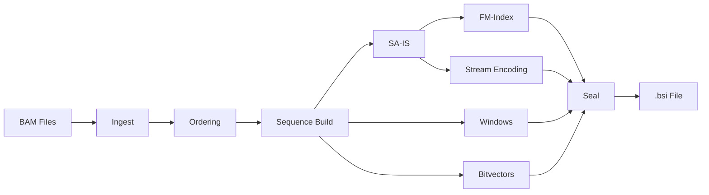

# BAMSIX Algorithms

**Reference:** Contract §3-§4, Architecture §4-§6

## Glossary

| Term | Definition |
|------|-----------|
| **S** | Concatenated read sequences: r₀ # r₁ # ... # r_{N-1} |
| **Σ** | Alphabet = {A, C, G, T, N} (codes 0-4) |
| **#** | Read separator (code 5), not in Σ |
| **$** | Conceptual sentinel (code 6), never stored |
| **SA** | Suffix array of S$ |
| **BWT** | Burrows-Wheeler Transform derived from SA |
| **FM-index** | C array + Occ table + SA samples |
| **B_read** | Bitvector marking read start positions |
| **B_window** | Bitvector marking window start positions |

## Pipeline Overview



## Suffix Array Construction (SA-IS)

We use the SA-IS algorithm (Nong, Zhang & Chan, 2009) via `libsais` to construct the suffix array of S$ in O(|S|) time and O(|S|) space.

**BWT Derivation:**
```
BWT[i] = S$[(SA[i] - 1) mod (|S| + 1)]
```

Special cases:
- `BWT[sentinel_row] = S[|S| - 1]` (cyclic predecessor of the sentinel suffix)
- For `SA[i] = 0`: `BWT[i] = CODE_SENT` (the sentinel character)

## FM-Index

### C Array

C[c] = number of characters in S$ that are lexicographically smaller than c. Computed from character counts with sentinel (`$`) having the smallest rank.

Lexicographic order: `$ < A < C < G < N < T < #`

### Occurrence Table (Occ)

`Occ[c][i]` = count of character c in BWT[0..i) (half-open convention for the FM recurrence).

### LF Mapping

```
LF(r) = C[BWT[r]] + Occ[BWT[r]][r]
```

**Key property:** `SA[LF(r)] = (SA[r] - 1) mod (|S| + 1)`

### Backward Search

Given pattern P[0..m-1]:
```
lo, hi = 0, |S| + 1        // full SA range
for i = m-1 downto 0:
    c = P[i]
    lo = C[c] + Occ[c][lo]
    hi = C[c] + Occ[c][hi]
    if lo >= hi: return empty
return [lo, hi)
```

**Complexity:** O(m) per query, independent of |S|.

### SA Sample Locate

SA values are sampled every `s` rows (default s=64). To locate row `r`:
```
steps = 0
while r is not sampled:
    r = LF(r)
    steps++
return (SA_sample[r / s] + steps) mod (|S| + 1)
```

**Worst-case locate:** O(s) LF steps per occurrence.

## Strand-Complete Counting

For StrandMode::StrandComplete (default):
```
GlobalCount(P) = count(P) + count(rc(P))  if P ≠ rc(P)
GlobalCount(P) = count(P)                 if P = rc(P) (palindrome)
```

Reverse complement: A↔T, C↔G, N→N, reverse the sequence.

## CIGAR Mapping (Architecture §5.2)

Maps a match position in S to a genomic coordinate using the read's CIGAR string:

```
cigar_ref_pos(cigar, p_anchor, offset, direction)
```

Traversal processes CIGAR ops maintaining `ref_pos` and `read_pos`:

| Op | Read | Ref | Action |
|----|------|-----|--------|
| M, =, X | ✓ | ✓ | Direct mapping |
| I | ✓ | — | Map to nearest aligned base |
| D, N | — | ✓ | Skip reference positions |
| S | ✓ | — | Map to nearest aligned base |
| H, P | — | — | No-op |

## Separator Detection (I14)

Separator positions are identified using B_read bitvector operations only (no raw S access):

A position `pos` is a separator iff:
1. `pos > 0`
2. `B_read[pos] == 0` (not a read start)
3. `B_read[pos + 1] == 1` (next position is a read start)

## Window-Based Region Pruning

Regional queries use windows to avoid scanning the full SA range:

1. Find all windows overlapping the query region `[chrom, a, b]`
2. For each FM-index match, locate the S-position
3. Use B_read rank/select to identify the read
4. Use the read's mapping data to determine genomic coordinates
5. Filter to matches within `[a, b]`

**Complexity:** O(m + occ · s + |W_match|) where |W_match| is the number of matching windows.
